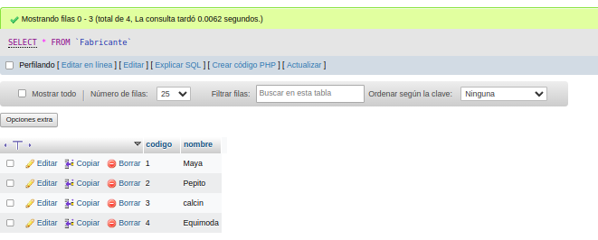

# Zapateria_-Base_datos
# phpmyAdmin
Avance de nuevos ejemplos en phpmyadmin
# consulta_1_sql
# Introduccion a las consultas a una BD usando el lenguaje SQL

## Base de datos: Ventas
## Tabla: Fabricante

|Campo|Tipo de dato|Longitud|
|-----|------------|--------|
|***codigo**| varchar|20|
|nombre|varchar|20|

## Tabla: Articulos

|Campo|Tipo de dato|Longitud|
|-----|------------|--------|
|***codigo**|varchar|20|
|nombre|varchar|20|
|precio|varchar|20|
|codigo_fab|varchar|20|

## Tabla: Relación

### CONSULTA No. 1
1. Obtener los nombres de los productos de la Zapateria

SELECT nombre FROM Articulo;

### CONSULTA No. 2
2. Obtener los nombres y los precios de los productos de la Zapatería.

SELECT nombre, precio FROM Articulo;

### CONSULTA No. 3
3. Obtener el nombre de los productos cuyo precio sea menor o igual a 50000

SELECT nombre, precio FROM Articulo WHERE precio <= 50000;

### CONSULTA No. 4
4. Obtener todos los datos de los artículos cuyo precio esté entre 5000 y 40000 (ambas canditades incluidas)

SELECT * FROM Articulo WHERE precio BETWEEN 5000 AND 40000;

## CONSULTA No. 5
5. Obtener el nombre y el precio de cada artículo, en dolares.

SELECT nombre, precio / 4240 as precio_en_dolares FROM Articulo;

## CONSULTA No. 6
6. Obtener el precio promedio de todos los artículos

SELECT AVG(precio) AS precio_promedio FROM Articulo;

## CONSULTA No. 7
7. Obtener el precio medio de los artículos cuyo codigo de fabricante sea 2.

SELECT AVG(precio) AS precio_medio FROM Articulo WHERE codigo_fab = 2;

## CONSULTA No. 8
8. Obtener el número de artículos cuyo precio sea mayor o igual a 50000

SELECT COUNT(*) AS numero_de_articulos FROM Articulo WHERE precio >= 50000;

## CONSULTA No. 9
9. Obtener el nombre y precio de los artículos cuyo precio sea mayor o igual a 50000 y ordenarlos descendentemente por precio, y luego ascendentemente por nombre.

SELECT nombre, precio FROM Articulo WHERE precio >= 50000 ORDER BY precio DESC, nombre ASC;

## CONSULTA No. 10
10. Obtener un listado completo de artículos, incluyendo por cada articulo los datos del artículo y de su fabricante.

SELECT Articulo.*, Fabricante.* FROM Fabricante INNER JOIN Articulo ON Fabricante.codigo=Articulo.codigo_fab;

## CONSULTA No. 11
11. Obtener un listado de articulos, incluyendo el nombre del articulo, su precio y el nombre de su fabricante.

SELECT a.nombre AS nombre_articulo, a.precio, f.nombre AS nombre_fabricante
FROM Articulo AS a
JOIN Fabricante AS f ON a.codigo_fab = f.codigo;

## CONSULTA No. 12
12. Obtener el precio medio de los productos de cada frabricante, mostrando solo los codigos de fabricante.

SELECT codigo_fab, AVG(precio) AS precio_medio
FROM Articulo
GROUP BY codigo_fab;

## CONSULTA No. 13
13. Obtener el precio medio de los productos de cada fabricante, mostrando el nombre del fabricante.

SELECT f.nombre AS nombre_fabricante, AVG(a.precio) AS precio_medio FROM Articulo a JOIN Fabricante f ON a.codigo_fab = f.codigo GROUP BY a.codigo_fab;

## CONSULTA No. 14
14. Obtener el nombre de los fabricantes que ofrezcan productos cuyo precio medio sea mayor o igual a 50000

SELECT f.nombre AS NombreFabricante FROM Fabricante AS f INNER JOIN Articulo AS a ON f.codigo = a.codigo_fab GROUP BY f.nombre HAVING AVG(a.precio) >= 50000;

## CONSULTA No. 15
15. Obtener el nombre y el precio del artículo mas barato.

SELECT nombre, precio FROM Articulo WHERE precio = (SELECT MIN(precio) FROM Articulo);

